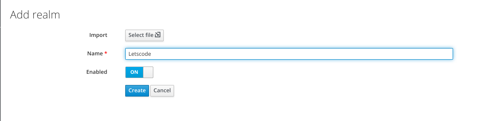
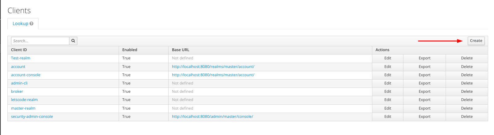
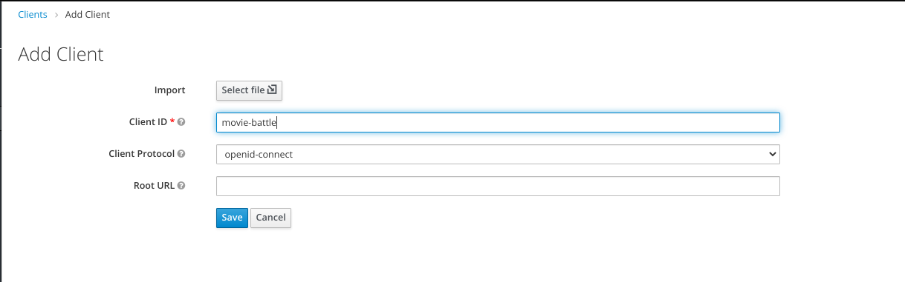
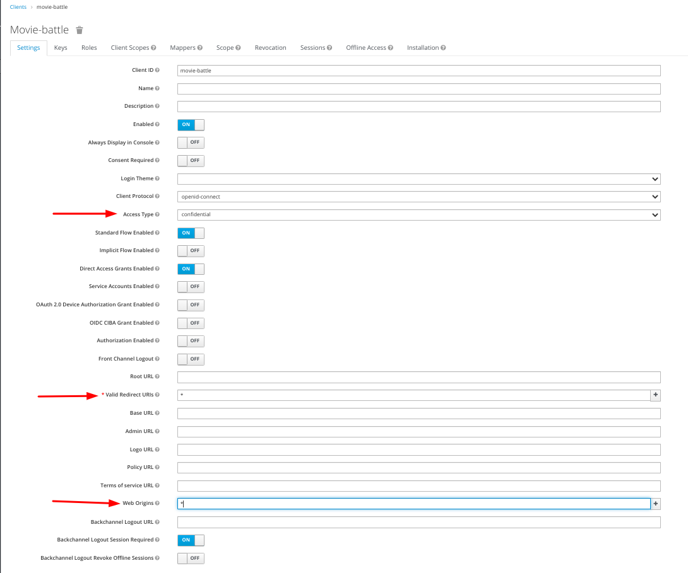
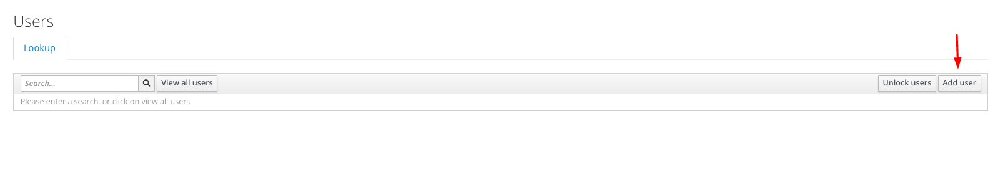
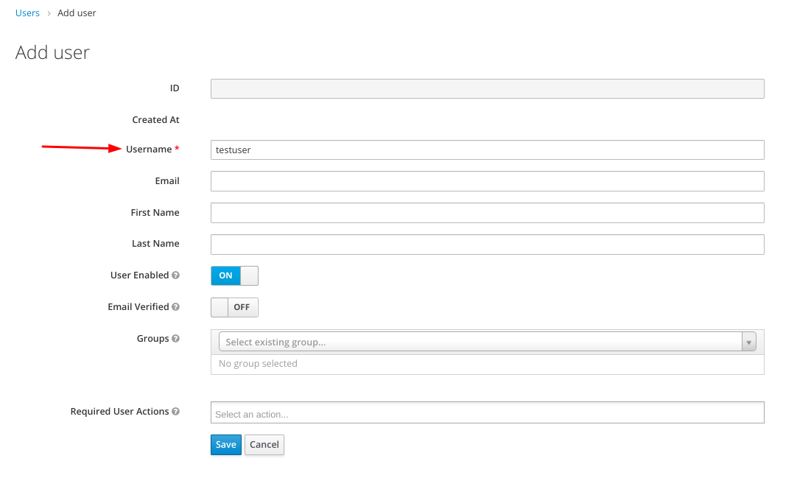
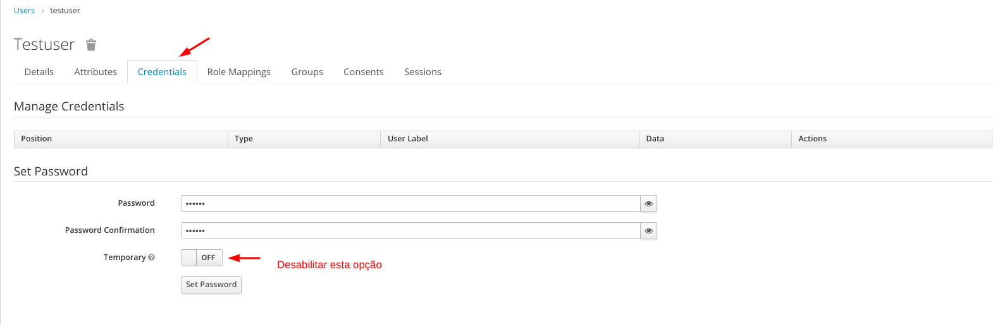
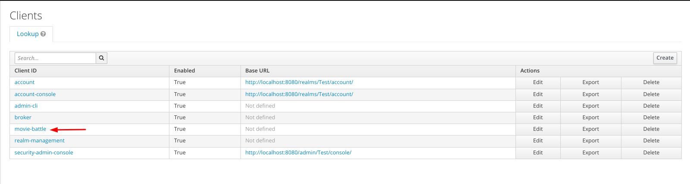
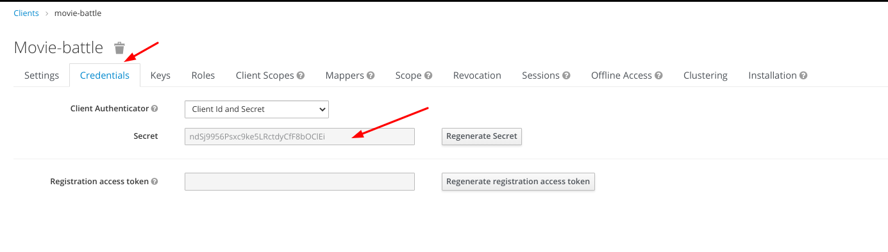

# Let's Code - Movie Battle

## Descrição

A aplicação consiste em uma api rest de jogo onde são exibidos dois filmes a cada rodada e o usuário tem que adivinhar qual deles possui a maior nota de acordo com o imdb (https://www.imdb.com). Para isso, a api conta com os seguintes endpoints:
	
- POST /matches - inicia uma nova partida e como resposta exibe a rodada inicial de filmes
	
- GET /matches/rounds/current - exibe a os filmes (filme A e filme B) da rodada atual
	
- POST /matches/rounds/current/guess - permite que o usuário envie o seu palpite sobre qual filme tem a maior pontuação na rodada atual. Somente os valores 'A' e 'B' são permitidos como respostas válidas.
	
- DELETE /movie-battle/matches - encerra uma partida

## Configuração do ambiente

1 - Rodar o camando abaixo para rodar o container conteundo o keycloak que será usado como Authorization Server para a nossa aplicação

	docker run -p 8080:8080 --name keycloak -e KEYCLOAK_ADMIN=admin -e KEYCLOAK_ADMIN_PASSWORD=admin quay.io/keycloak/keycloak:17.0.0 start-dev
	
2 - Crie um novo reaml.

3 - Crie um novo client chamado 'movie-battle'

4 - No formulário que aparecerá em seguida, preencha de acordo com a imagem abaixo e depois clique no botão 'Save':

5 - Criando os usuários da aplicação:

Obs.: Você pode criar quantos usuários quiser, mas o usuário 'testuser' com a senha '123456' será necessário para rodar os testes de integração.

6 - Obtendo a secret key do client:

Obs: Salve este secret pois ele será usado na aplicação.

# Rodando a aplicação

1 - Primeiro, vá para a raiz da aplicação e faça o build da aplicação.

	mvn clean install -Drealm-name=Letscode -Dclient-secret=<your-client-secret>

2- Rodando a aplicação

	java -jar target/lestcode-movie-battle-1.0.jar --realm-name=Letscode --client-secret=<your-client-secret>
	
# Swagger (OpenApi 3.0)

http://localhost:8083/movie-battle/swagger-ui.html

